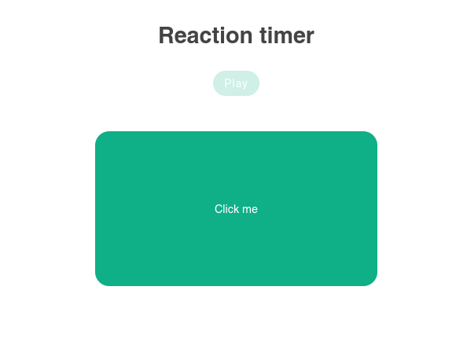
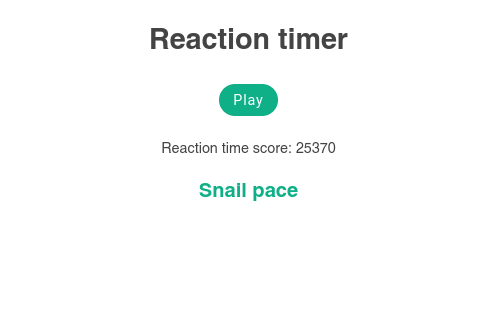

# reaction-timer 

### course by shaun pelling in udemy

## The result project would look like so:

### Start the game


### Result of the game after you click the green box


## Project setup
```
npm install
```

### Compiles and hot-reloads for development
```
npm run serve
```

### Compiles and minifies for production
```
npm run build
```

### Customize configuration
See [Configuration Reference](https://cli.vuejs.org/config/).
